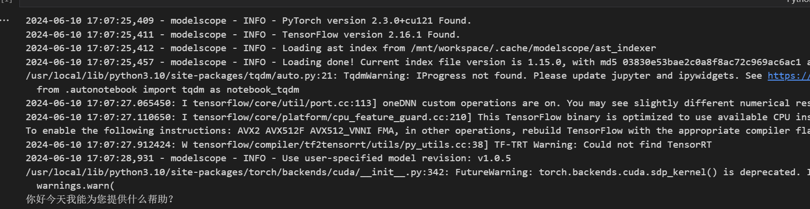
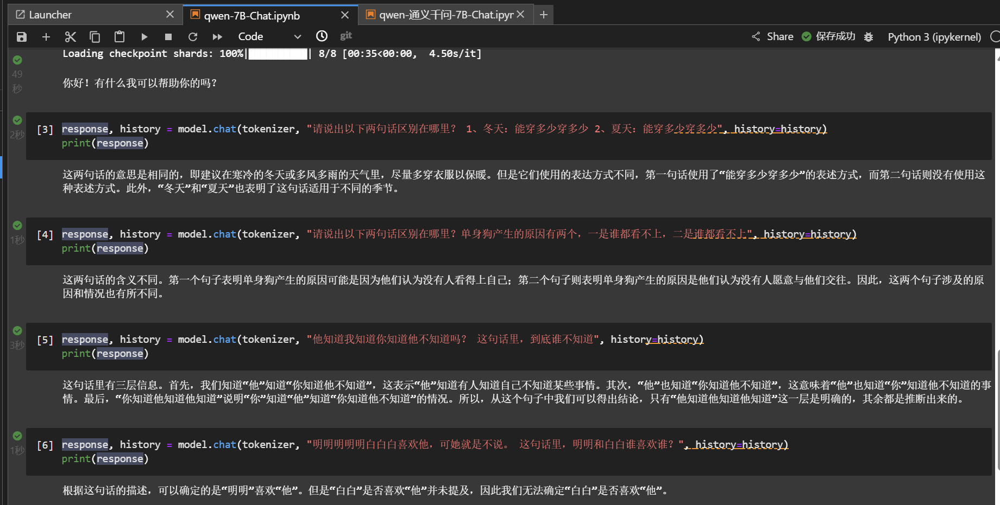

<h1>横向对比分析：评估主流大型语言模型在复杂语言处理任务中的表现</h1>

2252700 李一鑫

------

[TOC]

### 1. 实验背景和目的

#### 1.1 背景
在当前的技术环境中，大型语言模型已经成为自然语言处理领域的重要工具，广泛应用于各种语言理解和生成任务。这些模型通过大规模的数据训练，能够理解和生成复杂的语言结构，因此在多种应用中表现出色，如聊天机器人、文本摘要、问题回答等。随着模型的发展，市场上出现了多种不同的大型语言模型，如百川2-7b、Qwen-7B-Chat、ZhipuAI-chatglm3-6b和书生·浦语-对话-7b等，它们在不同的任务和场景下表现各异。

#### 1.2 目的
本实验的主要目的是对比和评估这些大型语言模型在处理复杂的逻辑和语言问题时的表现。通过系统的横向对比分析，我们可以更深入地理解每个模型的优势和局限性。实验将围绕以下几个关键目标进行：

1. **评估准确性**：分析各模型在理解和回答问题时的准确性，即它们是否能准确捕捉问题的核心和提供正确的答案。
2. **测试信息完整性**：评估模型在回答问题时提供的信息是否全面，即答案是否覆盖了问题的所有相关方面。
3. **分析逻辑性和连贯性**：探讨各模型提供的答案在逻辑结构和表达连贯性方面的表现。
4. **考察语言流畅性和自然度**：评价模型生成的语言是否流畅自然，以及其在自然语言交互中的表现如何。

通过这些评估，期望能够为未来模型的选择和应用提供科学的参考依据，特别是在选择最适合特定应用场景的模型时。此外，本实验的结果也将有助于推动大型语言模型的优化和发展，为自然语言处理技术的进步贡献力量。

### 2. 实验环境设置

基于魔搭平台云计算资源部署大语言模型

### 3. 模型部署

#### 3.1 百川2-7b

#### 3.2 Qwen-7B-Chat

#### 3.3 ZhipuAI-chatglm3-6b

#### 3.4 书生·浦语-对话-7b

### 4. 问答测试设计与执行

#### 4.1 测试设计

##### 问题1
**问题内容**：请说出以下两句话区别在哪里？ 1、冬天：能穿多少穿多少 2、夏天：能穿多少穿多少

- **测试目的**：评估模型对语境和情境的理解能力，特别是在处理相似表达但含义不同的语句时。
- **预期输出**：模型应能区分“冬天”和“夏天”对“能穿多少穿多少”这一表达的不同含义和建议。
- **评估标准**：准确描述冬季和夏季建议的差异，以及这些建议背后的逻辑。

##### 问题2
**问题内容**：请说出以下两句话区别在哪里？单身狗产生的原因有两个，一是谁都看不上，二是谁都看不上

- **测试目的**：评估模型处理语义重复和潜在讽刺或幽默表达的能力。
- **预期输出**：模型应识别到表面上的语言重复，并提供关于这种表达可能隐含的幽默或批评的解释。
- **评估标准**：回答应展示对语言细节的敏感性和理解幽默或双重含义的能力。

##### 问题3
**问题内容**：他知道我知道你知道他不知道吗？ 这句话里，到底谁不知道

- **测试目的**：评估模型的逻辑推理能力和处理复杂递归语句的能力。
- **预期输出**：模型应能解析这一复杂的逻辑结构，并确定是否有人不知道以及谁不知道。
- **评估标准**：提供逻辑上合理且清晰的解释，说明句子中各主体的知识状态和逻辑关系。

##### 问题4
**问题内容**：明明明明明白白白喜欢他，可她就是不说。 这句话里，明明和白白谁喜欢谁？

- **测试目的**：评估模型理解复杂、模糊或多义的情感表达的能力。
- **预期输出**：模型应分析句子结构，确定明明和白白的情感倾向。
- **评估标准**：清楚地识别和解释涉及的人物和他们的情感状态。

##### 问题5
**问题内容**：领导：你这是什么意思？ 小明：没什么意思。意思意思。 领导：你这就不够意思了。 小明：小意思，小意思。领导：你这人真有意思。 小明：其实也没有别的意思。 领导：那我就不好意思了。 小明：是我不好意思。请问：以上“意思”分别是什么意思。

- **测试目的**：评估模型处理日常对话中的多义词和语境变化的能力。
- **预期输出**：模型应能区分不同“意思”的语境和语义含义。
- **评估标准**：输出应详细解释每个“意思”的具体含义，展示模型对日常会话的理解深度。

#### 4.2 测试过程

##### 4.2.1 百川2-7b

##### 4.2.2 Qwen-7B-Chat

##### 4.2.3 ZhipuAI-chatglm3-6b

##### 4.2.4 书生·浦语-对话-7b

#### 4.3 测试结果

|                         | 问题1：请说出以下两句话区别在哪里？ 1、冬天：能穿多少穿多少 2、夏天：能穿多少穿多少 | 问题2：请说出以下两句话区别在哪里？单身狗产生的原因有两个，一是谁都看不上，二是谁都看不上 | 问题3：他知道我知道你知道他不知道吗？ 这句话里，到底谁不知道 | 问题4：明明明明明白白白喜欢他，可她就是不说。 这句话里，明明和白白谁喜欢谁？ | 问题5：领导：你这是什么意思？ 小明：没什么意思。意思意思。 领导：你这就不够意思了。  小明：小意思，小意思。领导：你这人真有意思。 小明：其实也没有别的意思。 领导：那我就不好意思了。 小明：是我不好意思。请问：以上“意思”分别是什么意思。 |
| ----------------------- | :----------------------------------------------------------- | :----------------------------------------------------------- | :----------------------------------------------------------- | :----------------------------------------------------------- | :----------------------------------------------------------- |
| **百川2-7b**            | 这两句话的区别在于所描述的季节和穿衣建议。    1.  “冬天：能穿多少穿多少”这句话强调的是在冬天，人们应该根据自己的舒适度来穿衣服，尽量穿更多的衣物来保暖。这可能包括穿厚衣服、围巾、帽子等。          2.  “夏天：能穿多少穿多少”这句话在夏天提到的穿衣建议与冬天类似，即人们也应该根据自己的舒适度来穿衣服，尽量穿更多的衣物来散热。这可能包括穿薄衣服、短裤、凉鞋等。          总的来说，这两句话的主要区别在于所描述的季节以及相应的穿衣建议。在冬天，建议穿更多的衣物来保暖；而在夏天，建议穿更多的衣物来散热。 | 这两句话的区别在于它们所表达的含义。1.  “单身狗产生的原因有两个，一是谁都看不上”这句话表达的是单身狗产生的一个原因，即个人对恋爱或伴侣的要求过高，导致无法找到合适的伴侣，从而成为单身狗。2. “二是谁都看不上”这句话似乎是在解释为什么第一个原因会导致单身狗，但这句话本身并没有明确的意义，可能是表达者的一种幽默或者自嘲。          总的来说，这两句话的主要区别在于它们的含义和表达方式。第一句话明确地表达了单身狗产生的一个原因，而第二句话则可能是一种模糊或者幽默的表达。 | 这句话是一个经典的谜语，实际上它是在测试我们的逻辑推理能力。"他知道我知道你知道他不知道吗？"  这句话里，实际上没有人不知道任何事情。          首先，"他"是指某个人或者事物，但是这个人或事物本身并不知道任何事情。           然后，"知道"这个词有两种理解方式，一种是实际知道，另一种是知道别人知道。如果从第一种理解方式来看，那么没有人真正知道任何事情。如果从第二种理解方式来看，那么只有知道别人知道的人才知道这个人或事物不知道什么事情。          所以，这句话实际上是在测试我们如何理解"知道"这个词，以及如何推理出结果。 | 这句话是一个谜语，它的意思是“明明明白白白喜欢他，可她就是不说”。在这个谜语中，我们需要找出谁是明明，谁是白白，以及谁喜欢谁。          根据谜语的描述，我们可以得出以下信息：          1. 明明和白白都是人名。     2. 明明明白白白喜欢他（指某个特定的人或事物）。     3. 可她就是不说。          然而，这个谜语并没有提供足够的信息来确定谁是明明，谁是白白，以及谁喜欢谁。这需要我们根据谜语的描述进行推理。           如果我们将“他”理解为一个人，那么可能是明明喜欢白白，也可能是白白喜欢明明，或者是两个人都喜欢对方。如果我们将“他”理解为某个事物，那么可能是明明喜欢白白，也可能是白白喜欢明明，或者是两个人都喜欢这个事物。          因此，这个谜语并没有一个确定的答案，需要我们根据谜语的描述进行推理。 | 这段话中，"意思"这个词在不同的句子中有不同的理解：          1. "你这是什么意思？"  这个句子中，"意思"表示的是某种行为或言语的意图或目的。小明回答"没什么意思"，意味着他的行为或言语没有特定的意图或目的。          2. "你这就不够意思了"，这里的"意思"是一种贬义，表示小明的行为或言语不够真诚，不够朋友。          3. "你这人真有意思"，这里的"意思"是一种褒义，表示领导觉得小明这个人很有趣，很有个性。          4. "其实也没有别的意思"，这里的"意思"再次表示没有特定的意图或目的。          5. "那我就不好意思了"，这里的"意思"是一种礼貌的表达，表示领导愿意接受小明的道歉。          6. "是我不好意思"，这里的"意思"是一种自我承认的道歉，表示小明承认自己的过错。 |
| **qwen-7B-Chat**        | 这两句话的意思是相同的，即建议在寒冷的冬天或多风多雨的天气里，尽量多穿衣服以保暖。但是它们使用的表达方式不同，第一句话使用了“能穿多少穿多少”的表述方式，而第二句话则没有使用这种表述方式。此外，“冬天”和“夏天”也表明了这句话适用于不同的季节。 | 这两句话的含义不同。第一个句子表明单身狗产生的原因可能是因为他们认为没有人看得上自己；第二个句子则表明单身狗产生的原因是他们认为没有人愿意与他们交往。因此，这两个句子涉及的原因和情况也有所不同。 | 这句话里有三层信息。首先，我们知道“他”知道“你知道他不知道”，这表示“他”知道有人知道自己不知道某些事情。其次，“他”也知道“你知道他不知道”，这意味着“他”也知道“你”知道他不知道的事情。最后，“你知道他知道他知道”说明“你”知道“他”知道“你知道他不知道”的情况。所以，从这个句子中我们可以得出结论，只有“他知道他知道他知道”这一层是明确的，其余都是推断出来的。 | 根据这句话的描述，可以确定的是“明明”喜欢“他”。但是“白白”是否喜欢“他”并未提及，因此我们无法确定“白白”是否喜欢“他”。 | 根据这段对话，可以分析出以下几个意思：          1. “你这是什么意思？”：意思是询问对方的想法或意图。     2. “没什么意思。”：意思是并没有特别的意思。     3. “意思意思。”：意思是表达自己的感受或想法，并非有意让人误解。     4. “小意思，小意思。”：意思是不必在意，只是客气的话而已。     5. “你这人真有意思。”：意思是形容对方很有趣。     6. “其实也没有别的意思。”：意思是没有什么其他的打算或想法。     7. “那我就不好意思了。”：意思是觉得不太合适或有点尴尬。     8. “是我不好意思。”：意思是自己应该感到抱歉。          以上就是这些话语中的意思。 |
| **ZhipuAI-chatglm3-6b** | 这两句话的区别在于季节和气候不同。冬天通常气温较低，需要保暖，所以建议穿较多的衣服，以保持身体温暖；而夏天气温较高，建议穿较少的衣服，以保持身体凉爽。因此，两句话所传达的建议和观念也不同。 | 这两句话都描述了单身狗的情况，但用词和表达方式不同。          1. 单身狗产生的原因有两个，一是谁都看不上，二是谁都看不上。          在这句话中，“谁看不上”是主语，表示单身狗的存在是因为他/她自己看不上别人，这可能是因为他/她自己的要求太高，或者他/她没有找到合适的人。          2. 单身狗产生的原因有两个，一是谁都看不上，二是谁都看不上。          在这句话中，“谁看不上”是宾语，表示单身狗的存在是因为别人看不上他/她，这可能是因为他/她的外表、性格、经济状况等方面存在一些问题，或者他/她没有展现出自己的魅力。无论哪种情况，都可能导致单身狗的情况。 | 这句话有点绕，但是根据语境可以分析出：          他知道我知道他不知道，这句话表明说话者 A 知道 B 不知道的事情 C，但是 C 也知道 B  不知道的事情。这里有一个未知数，即C知道B不知道的事情，也就是说话者A不知道的事情。 | 这句话的意思是，明明知道白白喜欢他，但白白就是不说。那么根据这个信息，我们可以得出结论：白白喜欢他。 | 1. 意思：表示言语或行动所表示的含义或意义。          领导：你这是什么意思？——领导询问小明的话，表示对小明言语或行为含义的理解不明。          2. 意思：表示言语或行为所传递的信息或意义。          小明：没什么意思。意思意思。——小明回答领导的问话，表示他的言语或行为没有特别的含义或意义。          3. 意思：表示言语或行为所暗示的含义或意义。          领导：你这就不够意思了。——领导对小明的话表示不满，认为小明的回答不够充分或不够明确。          4. 意思：表示言语或行为所暗示的含义或意义。          小明：小意思，小意思。——小明回答领导的问话，表示他的回答只是微不足道的小事情，并不重要。          5. 意思：表示言语或行为所传递的信息或意义。          领导：你这人真有意思。——领导对小明的话表示赞赏，认为小明的人格或行为有趣。          6. 意思：表示言语或行为所传递的信息或意义。          小明：其实也没有别的意思。——小明回答领导的问话，表示他的回答只是简单的回答问题，并没有其他的意思。          7. 意思：表示言语或行为所暗示的含义或意义。          领导：我就不好意思了。——领导对小明的话表示抱歉，认为自己问的问题让小明不好意思了。 |
| **书生·浦语-对话-7b**   | 1、冬天：能穿多少穿多少 2、夏天：能穿多少穿多少              | 单身狗产生的原因有两个，一是谁都看不上，二是谁都看不上       | 这句话里，我不知道                                           | 明明喜欢白白                                                 | “意思”分别表示：  1、“没什么意思”：表示没有其他意思，只是单纯地表示没有其他意思。 2、“小意思”：表示对方做的是一件很小的事情，不需要太在意。  3、“不好意思”：表示对对方的行为或言语感到抱歉或不好意思。 4、“不好意思了”：表示对对方的行为或言语感到非常抱歉，需要对方原谅。 |

#### 4.4 结果分析

##### 问题1：请说出以下两句话区别在哪里？ 1、冬天：能穿多少穿多少 2、夏天：能穿多少穿多少

+ **百川2-7b**

  - 详细解释了冬季和夏季穿衣建议的不同原因，分别提到穿衣的目的（保暖和散热），并给出具体的穿着建议（如厚衣服和薄衣服）。

  - 准确地反映了季节变化对穿衣风格的影响，适用于实际生活中的常识。

+ **Qwen-7B-Chat**
  - 尽管观点与百川类似，但此回答未能明确解释两句话的具体区别，略显模糊，可能导致理解上的混淆。

+ **ZhipuAI-chatglm3-6b**
  - 直接指出了季节和气候的不同，以及这些差异如何影响穿衣建议，虽简洁但有效。

+ **书生·浦语-对话-7b**
  + 回答非常简洁，未提供具体的穿衣建议或季节性解释，可能对于需要详细解释的用户不够充分。

##### 问题2：请说出以下两句话区别在哪里？单身狗产生的原因有两个，一是谁都看不上，二是谁都看不上

+ **百川2-7b**
  + 提供了关于单身狗成因的详尽解释，探讨了自嘲和幽默的表达方式，显示了对语言细节的敏感性。

+ **Qwen-7B-Chat**
  - 尝试解释两个句子之间的差异，但实际上两句话在表达上没有区别，解释看起来过于牵强。

+ **ZhipuAI-chatglm3-6b**
  - 提供两种不同的观点来解释单身狗的成因，一种是主观原因，一种是客观原因，视角较为全面。

+ **书生·浦语-对话-7b**
  + 回答过于简洁，未能提供关于问题的深入分析或解释，可能不足以满足寻求详细答案的用户。

##### 问题3：他知道我知道你知道他不知道吗？ 这句话里，到底谁不知道

+ **百川2-7b**
  - 提供了一个深入的逻辑分析，解释了这是一个逻辑谜题，强调实际上在逻辑上没有人不知道任何事情。这种回答显示了模型对逻辑结构的理解和解释能力。

+ **Qwen-7B-Chat**
  - 详细解释了句子中的逻辑层级。

+ **ZhipuAI-chatglm3-6b**
  - 回答过于简单，没有深入探讨逻辑谜题的复杂性。

+ **书生·浦语-对话-7b**
  - 回答没有提供有用的信息，未能捕捉问题的核心。

##### 问题4：明明明明明白白白喜欢他，可她就是不说。 这句话里，明明和白白谁喜欢谁？

+ **百川2-7b**
  - 没有清楚地表明明明和白白之间的具体情感状态，留下了一些模糊的地方。

+ **Qwen-7B-Chat**
  - 指出明明喜欢他，但对白白的感情状态没有提供信息。

+ **ZhipuAI-chatglm3-6b**
  - 明确指出白白喜欢他，提供了一个清晰且完整的答案。

+ **书生·浦语-对话-7b**
  - 缺乏对问题更复杂部分的解析。

##### 问题5：领导：你这是什么意思？ 小明：没什么意思。意思意思。 领导：你这就不够意思了。 小明：小意思，小意思。领导：你这人真有意思。 小明：其实也没有别的意思。 领导：那我就不好意思了。 小明：是我不好意思。请问：以上“意思”分别是什么意思。

+ **百川2-7b**
  - 提供了详细且清晰的解释，区分了各种“意思”的含义，表现出对复杂对话和语言细节的敏感性。

+ **Qwen-7B-Chat**
  - 提供了详尽的解释，但某些部分可能对理解造成混淆，特别是在多义词的使用上。

+ **ZhipuAI-chatglm3-6b**
  - 解释了每个“意思”的含义，逻辑清晰且易于理解，表达流畅。

+ **书生·浦语-对话-7b**
  - 提供了一些基本解释，但在涵盖问题的全部复杂性方面仍显不足。

### 5. 横向对比分析

#### 5.1. 评估准确性
- **百川2-7b**：通常提供准确且与问题直接相关的回答，特别是在解释成语或双关语的含义时。
- **Qwen-7B-Chat**：回答大多准确，但有时可能因为过于复杂的解释而导致信息过载。
- **ZhipuAI-chatglm3-6b**：答案通常直接且准确，但在处理需要较深层次理解的问题时，简洁性可能牺牲了详细度。
- **书生·浦语-对话-7b**：提供的答案通常较简单，有时可能未完全捕捉到问题的核心，特别是在需要复杂逻辑推理的问题上。

#### 5.2. 测试信息完整性
- **百川2-7b**：在回答问题时往往提供详尽的背景信息和解释，特别是在对话或成语的多重含义方面。
- **Qwen-7B-Chat**：尽管提供深入的答案，有时可能包含非必要的信息，可能导致主题偏离。
- **ZhipuAI-chatglm3-6b**：提供的答案通常聚焦于核心问题，避免无关信息，但有时可能过于简洁。
- **书生·浦语-对话-7b**：答案简洁，有时缺乏足够的详细信息来全面回答问题。

#### 5.3. 分析逻辑性和连贯性
- **百川2-7b**：回答通常逻辑严谨，结构清晰，能够合理地将问题的各个部分串联起来。
- **Qwen-7B-Chat**：逻辑性强，但复杂的解释有时可能影响整体的连贯性，使得跟随答案的逻辑线索变得困难。
- **ZhipuAI-chatglm3-6b**：答案在逻辑上通常很连贯，简洁的回答有助于保持清晰的逻辑流。
- **书生·浦语-对话-7b**：简洁的回答有时缺乏必要的逻辑链接，可能需要进一步解释以提高连贯性。

#### 5.4. 语言流畅性和自然度
- **百川2-7b**：语言流畅自然，表达方式丰富多样，适合处理复杂的对话和文学风格的问题。
- **Qwen-7B-Chat**：在细节丰富的回答中，语言通常流畅，但复杂性有时影响易读性。
- **ZhipuAI-chatglm3-6b**：语言简洁流畅，易于理解，非常适合快速获取信息的场合。
- **书生·浦语-对话-7b**：虽然语言简洁，但有时过于简单，缺乏足够的表达深度。

### 6. 结论
- 对于需要准确、详细信息的应用场景，如学术研究或复杂的用户查询，**百川2-7b**和**Qwen-7B-Chat**更为适合。
- 对于需要快速直接回答的场景，**ZhipuAI-chatglm3-6b**提供了一个很好的选择，特别是在用户界面或即时反馈系统中。

- **书生·浦语-对话-7b**适用于那些需要快速理解且问题相对简单直接的场景。
